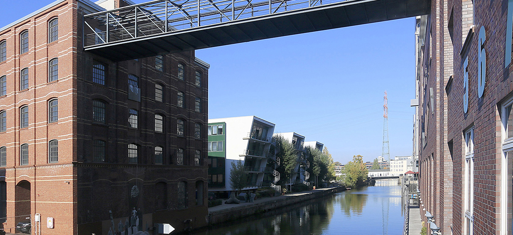

# Wasserstandsvorhersage des Harburger Hafens mit Feed-Forward Netzen / ANNs

## 🌍 Projektbeschreibung
Dieses Projekt nutzt Machine Learning zur Vorhersage von Wasserständen basierend auf historischen Daten. Die herangezogenen Daten stammen aus [opensensorweb.de](https://www.opensensorweb.de/de/data/?c=9.997314%2C53.471824&sid=pikobytes%24bafg%245952025%24w&v=sidebar&z=16.09).

## 📈 Zur Vorhersage: 
Eine Live-Demo der Anwendung ist hier verfügbar: [Streamlit Link](https://csv-automation-n4hzumwzdcoefrw3qrq9rs.streamlit.app/)

## 🤖 Technologien & Tools
- **Programmiersprache:** Python
- **Datenverarbeitung:** Pandas, NumPy
- **Machine Learning:** TensorFlow, scikit-learn
- **Visualisierung:** Matplotlib, Plotly
- **Automatisierung:** GitHub Actions
- **Web-Anwendung:** Streamlit

## ✅ Features
- **Datenaufbereitung:** Bereinigung und Analyse historischer Wasserstandsdaten
- **Modelltraining:** Entwicklung eines neuronalen Netzes zur Vorhersage
- **Automatisierung:** Automatische Modellaktualisierung und Datenerneuerung
- **Interaktive Visualisierung:** Web-App zur Darstellung der Vorhersagen

## 👥 Autor
**[by Daniel Christ]**  
Technomathematik-Student mit Interesse an Machine Learning und Data Science.  
Kontakt: [LinkedIn](https://www.linkedin.com/in/daniel-christ-397555290/)| E-Mail: da.christ@tuhh.de
